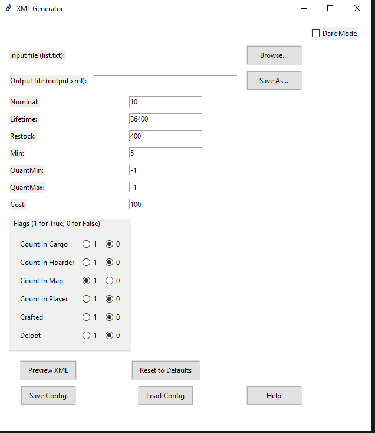
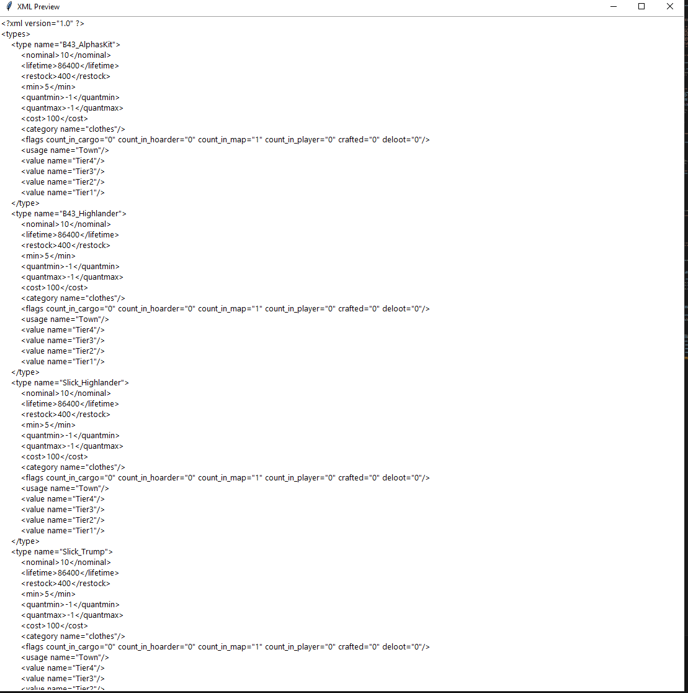

# XML Generator Application

This application generates XML files based on user-provided configurations. It is designed to read a structured `list.txt` input file, allowing users to customize item settings and preview the generated XML output.

## Features
- **Input and Output Configuration**: Select input and output files.
- **Default Value Settings**: Set values for `Nominal`, `Lifetime`, `Restock`, etc.
- **Dark Mode Toggle**: Switch between light and dark themes for better readability.
- **Preview XML**: View the generated XML output in a preview window before saving.
- **Configuration Management**: Save and load configurations for reuse, or reset to defaults.

## Installation
To use this application:
1. Ensure Python 3.x is installed.
2. Clone or download the repository.
3. Install any dependencies (e.g., Tkinter, which is usually included with Python).
4. Run the application:

   ```bash
   python class_creator.py
   
### Usage Instructions
Select Input File: Click Browse... to select an input file (list.txt).
Input Format: Each line in list.txt should follow the format type,class, such as clothing,B43_AlphasKit or weapons,AK47.
Specify Output File: Click Save As... to set the path and filename for the XML output.
Set Default Values: Adjust values for fields like Nominal, Lifetime, and Restock to customize the generated XML.
Dark Mode: Toggle between light and dark themes.
Preview XML: Click Preview XML to view the generated XML in a separate preview window.
Save and Load Configurations:
Save Config: Save current settings to a configuration file (config.json).
Load Config: Load settings from a saved configuration file.
Reset to Defaults: Revert all fields to their default values.

Expected Input File Format

The list.txt input file should contain items listed in the format:

type,class

Examples:

clothing,B43_AlphasKit
weapons,AK47

Buttons

    Browse...: Selects an input file (list.txt).
    Save As...: Specifies the output XML file path.
    Preview XML: Opens a window displaying the generated XML content.
    Save Config: Saves the current configuration to config.json.
    Load Config: Loads a previously saved configuration from config.json.
    Reset to Defaults: Resets all input fields to their default values.
    Help: Displays instructions on using the application.

Additional Notes

    Ensure the list.txt file follows the correct format to avoid errors.
    If the application cannot locate an input or output file, an error message will be displayed.

Example

Example XML generated for an item in the list.txt file:
```
<type name="B43_AlphasKit">
    <nominal>10</nominal>
    <lifetime>86400</lifetime>
    <restock>400</restock>
    <min>5</min>
    <quantmin>-1</quantmin>
    <quantmax>-1</quantmax>
    <cost>100</cost>
    <category name="clothes"/>
    <flags count_in_cargo="0" count_in_hoarder="0" count_in_map="1" count_in_player="0" crafted="0" deloot="0"/>
    <usage name="Town"/>
    <value name="Tier4"/>
    <value name="Tier3"/>
    <value name="Tier2"/>
    <value name="Tier1"/>
</type>
```

# Screenshots

****
****
****
****

License

This project is licensed under the MIT License. See the LICENSE file for more details.